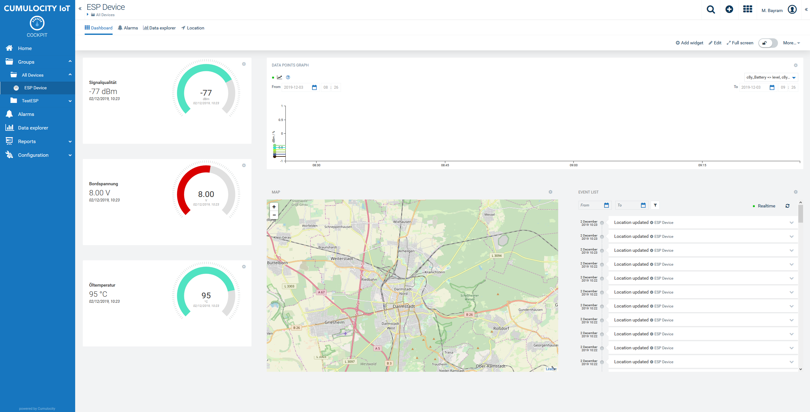
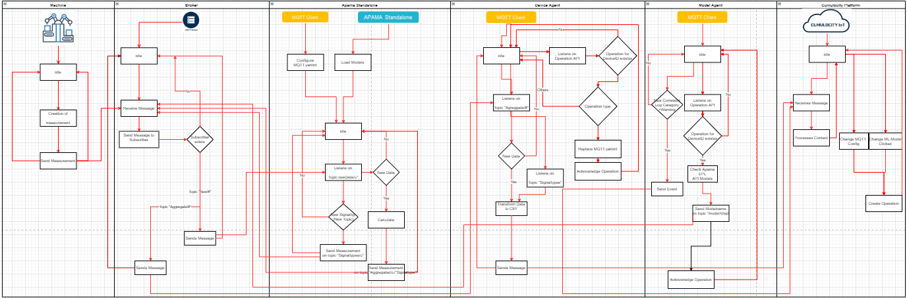

# ThinEdge
# Cumulocity Example for a Thin Edge based on Docker

Cumulocity is an IoT platform that enables rapid connections of many, many different devices and applications. It allows you to monitor and respond to IoT data in real time and to spin up this capability in minutes. More information on Cumulocity IoT and how to start a free trial can be found [here](https://www.softwareag.cloud/site/product/cumulocity-iot.html#/).

Cumulocity IoT enables companies to to quickly and easily implement smart IoT solutions.



______________________
For more information you can Ask a Question in the [TECHcommunity Forums](http://tech.forums.softwareag.com/techjforum/forums/list.page?product=webmethods-io-b2b).

You can find additional information in the [Software AG TECHcommunity](http://techcommunity.softwareag.com/home/-/product/name/webmethods-io-b2b).
______________________

These tools are provided as-is and without warranty or support. They do not constitute part of the Software AG product suite. Users are free to use, fork and modify them, subject to the license agreement. While Software AG welcomes contributions, we cannot guarantee to include every contribution in the master project.

Contact us at [TECHcommunity](mailto:technologycommunity@softwareag.com?subject=Github/SoftwareAG) if you have any questions.

## UML




## Getting Started

Getting stated is much easier on linux than on windows. For developement we used a Cent OS system.

### Prerequisites

1. Pull the repo
2. Login on hub.docker.com via web browser
3. Checkout in docker hub the following images:
    a) [Software AG Apama correlator](https://hub.docker.com/_/apama-correlator)
    b) [Software AG Apama Builder](https://hub.docker.com/_/softwareag-apama-builder)
    c) [Software AG Zementis Server](https://hub.docker.com/_/softwareag-zementis-server)

   Make sure you go all the way through the checkout process.
4. Currently you need an Apama License. However you can remove that part in the Dockerfile but some essential functionalities such as cdp inject won´t work with the communitiy edition.
5. In command line enter docker login and enter credentials (you need docker.io, install via yum or apt-get)
6. docker-compose up -d --build
7. Run the Agent via python3 run.py in the Agent directory


### Start

On Cumulocity side you have to register the device in your tenant. In the config.ini you have to use an identifier such as the serial number or mac address.
This serial number will be used for the registration purpose.

As soon as the containers are running you can start registering on your tenant.


### Update Monitor file


### Change Configuration


### Create Dashboard

### Update Model in Apama Analytics Builder


## Docker and Container

The Thin Edge example here includes the following services:

* [MQTT Broker](#Mosquitto)
* [Apama Correlator](#Apama)
* [Zementis](#Zementis)
* [Node-red](#Node-Red)
* [Device-Agent](#Device-Agent)

Those services are orchestered via a docker-compose file.

## Basic Docker container handeling

Basic command for Docker within this project:


* Starts thin edge container in background
      docker-compose up -d

* Build images before starting the thin edge container in background
      docker-compose up --build -d  

* List of running containers
      docker-compose ps

* Display log output of thin edge container with timestamp [-t], number of lines [--tail] and to follow log output [-f].
      docker-compose logs -t -f --tail=20

* Display log output of single container
      docker logs <container-name>

* Shut down thin edge container
      docker-compose stop

* Start/Stop single container
      docker start/stop <container-name>

Initialization from the level of the docker-compose file. You can remove or add services in this file e.g. if you need additional services or a changed mapping of volumes or ports.

### Mosquitto

Mosquitto is an open source implementation of a server for version 5.0, 3.1.1, and 3.1 of the MQTT protocol.
Documentation for the broker, clients and client library API can be found in the man pages, which are available online at https://mosquitto.org/man/. There are also pages with an introduction to the features of MQTT, the mosquitto_passwd utility for dealing with username/passwords, and a description of the configuration file options available for the broker.

Currently the mqtt broker is not protected with user/password, this can easily be changed with a configuration.

### Apama

Apama standalone is running within a container and directly listens on the MQTT via
You can control the apama incstance with the following commands:

* docker exec apama engine_inspect -h
      -m | --monitors               List monitor types
      -j   | --java                       List java applications
      -e  | --events                   List event types
      -t   | --timers                    List timers
      -x   | --contexts               List contexts
      -a   | --aggregates          List aggregate functions
      -R  | --receivers                List receivers
      -P  | --pluginReceivers     List plugin receivers
      -r   | --raw                        Raw (i.e. parser friendly) output
      -h  | --help                       This message
      -n  | --hostname <host>     Connect to an engine on <host>
      -p  | --port <port>           Engine is listening on <port>
      -v  | --verbose                  Be more verbose
      -V | --version                    Print program version info

* docker exec apama engine_inject 1.mon 2.mon 3.mon

    To inject applications into the correlator. Note: If the file 2.mon contains an error, then engine_inject successfully injects 1.mon and then terminates when it finds the error in 2.mon. The tool does not operate on 3.mon.

* docker cp HelloWorld.mon apama:/apama_work/Project_deployed/monitors

  Copy mon-file to container destination folder. Now, need to be injected...
      NOTE: After stop and restart apama container, mon-file still exists in
      container, but will not automatically be injected.
      docker-compose down removes mon-file completly from container.

* docker exec apama engine_inject ./Project_deployed/monitors/HelloWorld.mon

  Inject mon-file to running correlator.


### Device-Agent

Basically theses tasks are handled in different modules:

1. Registration of the device and handling of the credential file as well as device creation -> (deviceRegistration)
2. Basic RestAPI capabilities -> (API)
3. Capability to get operations from the platform -> (deviceControl)
4. Updating monitor files for streaming analytics -> (streamingAnalytics)
5. Utility modules such as reading of the monitor or settnig files and inter threadCommunication for multithreading -> (utils)
6. Updating the current status of the docker container stats and device stats -> (dockerWatcher/sendDockerStats and deviceStatus/sendDeviceStats)

Debugger is set to Info in every module, this makes debugging a lot easier. Change if you want.

#### API

Required and most commonly used RestAPI calls are modulized inside here. The naming of the modules is mainly derived from its API path such as e.g. alarm, event, measurement or Inventory. The authentification module is initialized at the very beginning of every module an uses the credentials.key file in the config directory. If not available the device Registration starts. If the credentials are not vallid they will be deleted. Every API module has its own logger.

#### deviceControl

Device control handles everything around operations handling from the platform to the device.
There are two main modules:

1. operationsWatcher -> Watches for operations on the particualar device and hands them over to the handler
2. operationsHandler -> Handles the logic of the operations and hands them over to dedicated modules

Dedicated modules in this context are e.g. the update of configuration with updating the managed object or the exchange of files on the local machine for e.g. epl files. Others can be added for later use-cases.

#### deviceRegistration

The device registration is implemented and documented here:

[Device Registration using Rest](https://cumulocity.com/guides/device-sdk/rest/)

After the registration process it is checked whether an managed object with particular identity is already available. If not a new device is created that contains the fragment of the Thind Edge use-case.

#### streamingAnalytics

The streamingAnalytics module has three modules. It consists of:

1. ModelSync -> Takes responsibility to sync models from the Thin Edge to the platform such that platform has the current status.
2. sendModelStats -> Communicates which models are active on the Thin Edge side.
3. modelExchange -> Is triggered by an operations in order to remove, move, write and load models on the Thin Edge side into the mounted directory of apama and injects the content into the correlator.

#### utils

Utils contains of many functinonalities that are required during the runtime of the agent such as reading out configuration files of the device or enabling the communication between threads.

##### Settings 

Reads data from config and credentials files. The config.ini file lays within the config directory and must contain the following

```shell
[C8Y]
tenantInstance = eu-latest.cumulocity.com

[Device]
id = 31011987

[Registration]
user = management/devicebootstrap
password = Fhdt1bb1f
tenant = management
tenantPostFix = /devicecontrol/deviceCredentials

[MQTT]
prefix = aggregated
prefixSignaltype = signalType
broker = localhost
port = 1883
```

These are informations that are required for the agent to be able to run properly. Feel free to add sections and variables.
The credentials.key file will be stored by the agent within the registration process. In this approach it is not saved crypted.

##### threadCommunications
##### readMonFiles

####dockerWatcher

The dockerWatcher contains a module that sends the docker stats from "docker stats" and "docker ps " to cumulocity. It therefore parses the content and creates an fragment "c8y_Docker" that contains metrics like memory, cpu and current status which will than be send to cumulocity. The ui uses that to visualize the current status.

####deviceStatus


